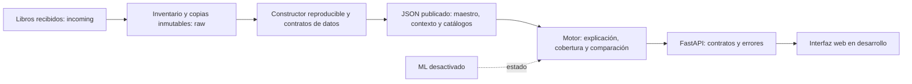

# Panorama del sistema implementado

ATLAS apoya la evaluación territorial preliminar por localidad en Irapuato y
Celaya. Sus usuarios previstos son despachos, desarrolladores y áreas de
planeación municipal. La validación con estos usuarios sigue pendiente.

## Componentes

| Componente | Responsabilidad y estado |
|---|---|
| Datos/SIG | 15 libros inventariados; maestro de 755 localidades/64 campos, serie de 50 observaciones estación-mes y extensión municipal de 57 campos. Hashes y reconstrucción comprobados. |
| Motor | Lee exclusivamente contratos y productos publicados; conserva valores y fuentes, explica estados, contextualiza por obra y compara A/B. No declara aprobación ni calcula un ganador. |
| Backend | Nueve rutas REST; valida entradas y resultados contra contratos JSON. No abre XLSX ni recalcula semántica territorial. |
| Frontend | Desarrollo en otra sesión; utiliza REST. El recorrido de navegador debe validarse separadamente. |
| ML | Estado de desactivación explícito. No hay modelo entrenado ni validado. |

Las capacidades espaciales actuales son asociación a localidades y consumo
de atributos/distancias recibidas. No existe cobertura continua del predio ni
cruce con todas las geometrías originales del núcleo territorial.

## Flujo

La selección incluye tipo de obra y coordenadas, opcionalmente una clave
publicada de localidad. La clave tiene prioridad; sin ella, se resuelve la
localidad más cercana dentro del límite del contrato y se informa cualquier
aproximación. Motor y API devuelven ficha, fuentes, cobertura, faltantes y
aspectos a revisar. La comparación reutiliza la misma matriz y tipo de obra.

## Ejecución y límites operativos

La API local utiliza un proceso Uvicorn sin recarga automática. El motor
mantiene datos en caché por proceso; tras cambiar código o publicación, el
responsable del proceso debe reiniciarlo. CORS admite orígenes explícitos de
desarrollo; no hay autenticación ni despliegue público validado. Los eventos
de API se registran en `backend/logs/`.

Los datos del motor son locales. La verificación HTTP no utiliza Internet;
el mapa y sus recursos requieren comprobarse en la sesión de frontend con
su estrategia de respaldo. La ausencia de un dato no implica ausencia de
riesgo y el antecedente 2014 no determina una amenaza actual.

## Verificación

`python3 scripts/demo/verify_technical.py` comprueba reconstrucción, originales,
contratos, pruebas y HTTP real. Evidencias en `docs/evidence/`. Estado por punto
en `IMPLEMENTATION_STATUS.md`; capas pendientes en `../data/PENDING_LAYERS.md`.
